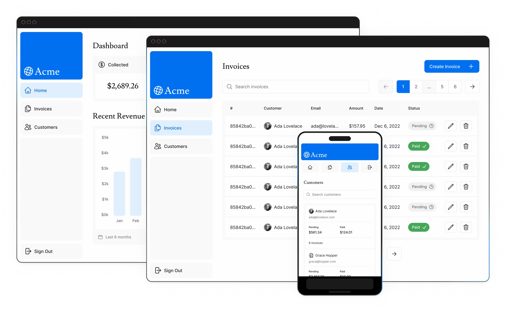

## Next.js Dashboard

This project is a modified version of the dashboard app from the the Next.js  [course curriculum](https://nextjs.org/learn).



It builds a simple financial dashboard that has:

- A public home page.
- A login page.
- Dashboard pages that are protected by authentication.
- The ability for users to search, add, edit, and delete invoices.

using the following libraries & frameworks:

- [Next.js](https://nextjs.org/) v14
- [React](https://react.dev/)
- [PostgreSQL](https://www.postgresql.org/)
- [Docker](https://www.docker.com/)
- [Prisma](https://www.prisma.io/) TypeScript ORM
- [Tailwind CSS](https://tailwindcss.com/) framework
- [Zod](https://zod.dev/) for schema validation
- [NextAuth](https://next-auth.js.org/) for authentication

## Prerequisites

- [Node.js](https://nodejs.org/en/download/)

## Set up

Clone the repository

```sh
git clone https://github.com/israataha/nextjs-dashbord
```

Install the dependencies

```sh
npm install
```

Create a copy of the `.env.example` file 
```sh
cp .env.example .env
```

Generate a NextAuth secret using 
```sh
openssl rand -base64 32
```
and copy the result into the `NEXTAUTH_SECRET` variable in the `.env` file

Start PostgreSQL Docker container
```sh
docker-compose up -d
```

To create the tables in your database, run

```sh
npx prisma db push
```

To view the data using Primsa studio run 

```sh
npx prisma studio
```

Run the seed script to populate your database with seed data.

```sh
npm run seed
```

## Run the App

Run the app with following command:

```sh
npm run dev
```

Open your browser at [localhost:3000](localhost:3000) to see the running application.

## Resources:
- [How to Build a Fullstack App with Next.js, Prisma, and Vercel Postgres](https://vercel.com/guides/nextjs-prisma-postgres)
[How to seed a database with Prisma and Next.js](https://planetscale.com/blog/how-to-seed-a-database-with-prisma-and-next-js)
https://github.com/planetscale/nextjs-starter/tree/main
